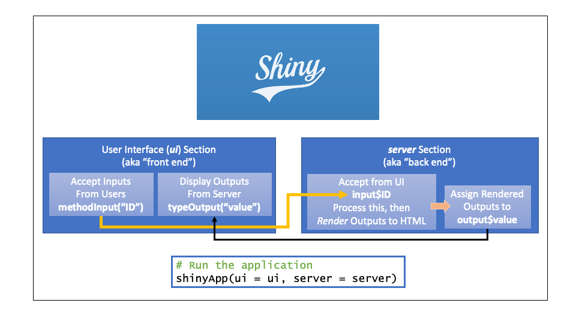
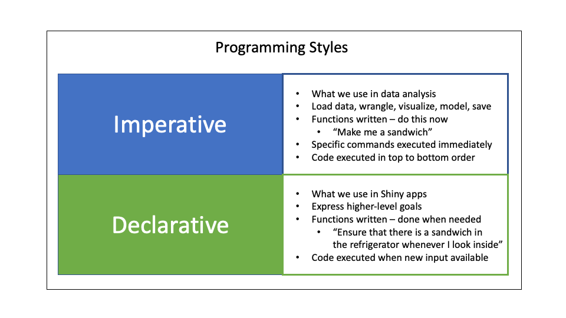
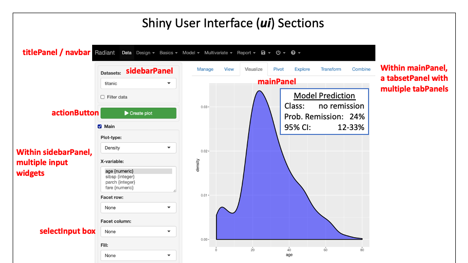
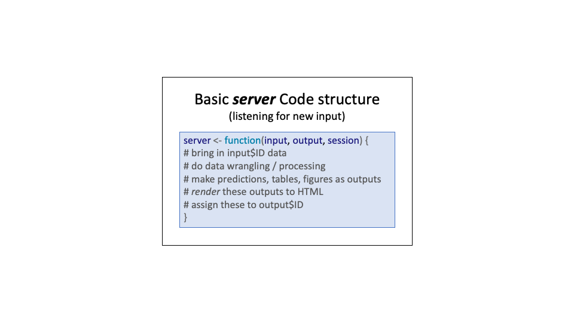
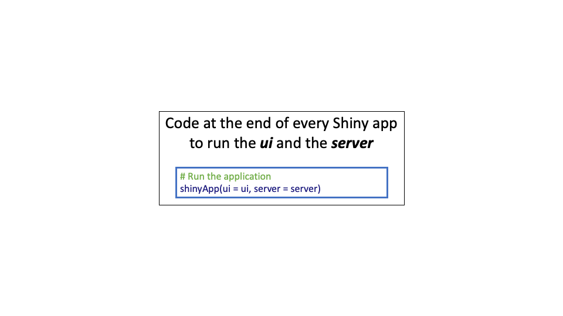

# A Gentle Introduction to Shiny

## What is Shiny?

Shiny is both an R package {shiny}, and a web framework for building web applications using R.
The {shiny} package helps you share your models, plots, or tables so that other people can use them in an interactive way.
Anyone with access to the web can look up your Shiny app model on their phone (or computer), enter a few values for predictor variables, and get an estimate for a continuous or a dichotomous outcome, without doing any calculations on their own.
This is a really powerful way to share your models.

It is often valuable to publish (serve) your model on a website before publishing in a medical journal, so that you can put the link to the Shiny app for the model in the manuscript.

It can sound a little intimidating to set out to build a web application if you have limited (or no) programming experience, but the {shiny} package and the teaching materials at the end of this chapter are designed to make it manageable.

## The Basic Structure of a Shiny App

A Shiny app has two sections, as seen in the diagram below:

-   the ***user interface (ui)*** section which accepts inputs from users, and displays output values to users

-   the ***server*** section, which ingests the input, processes the data, renders output values to HTML, and sends these back to the user interface (ui).

    You can see the flow of inputs and return values in the diagram below.
    Note that IDs and values in the user interface section are referred to with quotes ("ID", "value"), and IDs and values in the server section are referred to with dollar signs (input\$ID, output \$value).
    This can be a source of confusion (and syntax errors in your code), as the same user inputs and return values have different reference formats in each section of the Shiny app.
    Remember to use *quotes* to refer to input IDs and output values in the user interface section, and *dollar signs* to refer to the **same** IDs and output values in the server section.



### The weirdness of a Shiny app

Shiny apps use a different programming style from what we are used to for data analysis.
We normally use what is called an `imperative` programming style, in which we write commands that are carried out in order, as soon as we run them.

In contrast, Shiny apps use what is called a `declarative` programming style, which outlines higher-level goals, and lets the web app execute functions when it is activated by new input.
When it is run, the Shiny app ***listens*** for new input, and ***reacts*** to this input by:

-   Accepting the input in the ***user interface*** (ui) section

-   Executing functions (making new model predictions, generating a plot) in the ***server*** section

-   Rendering the output to HTML in the ***server*** section

-   Displaying the output in the ***user interface*** (ui) section



A Shiny app is ***reactive*** to new input.

## The User Interface Section Structure

The user interface (also known as the "front end" of an app is what the user sees and interacts with. This is often set up as a few sections:

-   The `titlePanel`

-   The `sidebarPanel`, where the user inputs data, which are assigned to specific "ID"s.

-   The `mainPanel`, where resulting values from the server are displayed as output "values".
    These can be model predictions, plots, tables, or other forms of R output.



To set up this structure, the code needs to be structured into sections, which are built with functions, as seen below.
When coding a user interface (ui) in a basic Shiny app:

You add a title to the `titlePanel()`.

You add input widgets and their labels to the `sidebarPanel()`.

You add titles, text and output to the `mainPanel()`.


The code to accomplish this has a similar hierarchy, as seen in the figure below.
Using this basic template, you will add and define arguments to the:

-   `titlePanel()`

-   `sidebarPanel()` with specific `typeInputs()`

-   `mainPanel()` with specific `typeOutputs()`


## The Server Section Structure

The server section is often described as the "back end" of the app.
The user does not see what happens in the server section but this is where the actual data processing occurs.
The server section accesses the inputs from the user as `input$ID`, where each input was assigned a unique "ID" in the user interface.
The server code will then process this data to generate outputs (model predictions, tables, plots, etc.), which are rendered to HTML.
These HTML rendered results are then assigned to unique `output$values`.



Once the outputs have been assigned to unique `output$values`, the user interface can access them as "value" (in quotes), and output them to the `mainPanel()`, using the appropriate `typeOutput("value")`.

## How to Run an App

The code part of running a Shiny app is always the same, and is quite simple.
The function is *shinyApp()* and the two arguments identify the user interface (ui) and the server code (server) being used.



To actually run the app, activating its listening for new input, and displaying new output in the ui, you can

-   click on the `Run App` button (with the green triangle icon) at the top of the Source Pane (top left pane by default).

-   Use a keyboard shortcut - Cmd+Shift+Enter on Mac, Ctrl-Shift-Enter on Windows

-   From the command line, call `shiny::runApp()` with the path argument being the path to the directory containing `app.R`.

### How to Stop an App

When your Shiny app is running, R is busy - the R prompt is not visible, and the console pane toolbar displays a stop sign icon.
You can also tsee that the R Console pane has an "away message".
It says something like `#> Listening on http://127.0.0.1:8763`.
This tells you the URL where your Shiny app can be found.
The URL 127.0.0.1 is the standard address that means "my computer", and 8763 is a randomly assigned port number.
You can open a browser on your computer, and enter that URL to open another copy of your Shiny app.

You can stop your app by:

-   Clicking the stop sign icon on the R Console pane toolbar.

-   Closing the Shiny app window.

-   Clicking in the Console pane, then pressing Esc (or Ctrl-C if using the command line).

## Building a Very Simple App (Version 1)

We will build a simple app to illustrate the flow of information between the ui and the server.
Open up RStudio, in a new session.
Select: File/New File/Shiny Web App.
Give the Application a name, like `shiny-test`, leave the default structure (Single File app.R), and select the directory to save it in, then click on the `Create` button.

You get the basic template for a basic Shiny app, with some comments to guide you.

Inspect the user interface section, and the server section.
Now let's run this app to see what it does.
Click on the `Run App` button at the top of the source pane.
This should open an app window, titled `Old Faithful Geyser Data`.
The *inputSlider* in the *sidebarPanel* starts at a default value of 30, and the *mainPanel* displays a histogram.
You can slide the input value to a different Number of Bins, and the histogram will rapidly be redrawn, in reaction to your new input.

### The ui section

If you have screen space, arrange and resize the windows so that the source window and the Shiny app are side by side.
Start by inspecting the ui section.
The sidebarPanel has one input, with an ID of "bins", with range from 1=50, and a default value of 30.
Can you find the code that defines this?

The mainPanel has only the plotOutput, but no code to make the plot.
It is displaying a "distPlot" that was created by the server section.

### The server section

Now scroll down to the server section.
This has a *renderPlot* function that renders a plot and assigns it to `output$distPlot`.
It uses `input$bins` from the ui and the *faithful* dataset to create the histogram plot in base R.
Note that the ui section uses quotes to refer to variables and the server section uses `$ format` to refer to variables.
This means that the "bins" input in the ui appears in the server as `input$bins`, and the `output$distPlot` in the server section appears as "distPlot" in the ui mainPanel.

## Edit this App (Version 2)

Go back to your app.R session of RStudio.
Notice that the Console pane does not have an active R prompt (`>`).
It is `Listening on http://127.0.0.1/7787` - note that the port number - the random 4 digit number at the end, will likely be different each time.

Stop running the app, by closing the app window, or clicking on the stop sign at the top right of the Console pane.

In the Source Pane tab for app.R, scroll to the ui and within that, the titlePanel.
Edit the title to "Medical Textbooks".

Now replace `sliderInput` with `selectInput`.
Change the inputID from "bins" to "book".
Change the label from "Number of bins:" to "Select a Textbook:" Delete the min, max, and value arguments.
Add a choices argument, with `choices = list("Textbook of Surgery", "Textbook of Gastroenterology", "Diseases of the Liver and Biliary System")`.
Double check that all your parentheses still match, and that you still have a comma between `sidebarPanel` and `mainPanel`.
Now Run the app again.
You should see a new sidebar, with a dropdown selection with 3 choices.
The mainPanel should no longer work, as the expected "bins" input is no longer there.

We will leave the mainPanel in its non-working state for now, and move to the server section to process the `input$book` data.

Scroll down to the server section.
Change `output$distPlot` to `output$name`.
Now change the `renderPlot` to `renderText`.

Now delete everything inside of `renderText` from `# generate bins` to `border = 'white')`.

After `renderText` there is now only an open parenthesis followed by an open curly brace, and a few lines later these are closed with a curly brace and a parenthesis.
If there is not much space between these, put in a few returns to open up some space.
Then paste the following into the `renderText` between the paren/curly brace combinations:

    output$name <- renderText({
        if(input$book == "Textbook of Surgery"
        ) {author = "David Sabiston"
        } else if(input$book == "Textbook of Gastroenterology"
        ) {author = "Tachi Yamada"
        } else if (input$book == "Diseases of the Liver and Biliary System"
        ) {author = "Sheila Sherlock"
        }
      author  
      })

This R code checks the input phrase, and assigns a particular value for `author` based on the phrase, much like a `case_when` function, but using the `if/else if` construction.
Then it *returns* the value for the new variable, author.
This is renderText-ed into the output\$name.
This will be sent to the ui as "name".

Now let's scroll back up to the mainPanel of the ui, and use this `"name"` variable to generate an output.

Find the mainPanel, and delete the plotOutput.

Inside the parentheses for mainPanel, paste the following:

    h3("Who Wrote It?"),
    br(),
    textOutput("name")

This will print `Who Wrote It?` in header 3 format, followed by a line break, followed by the `name` from the server.

Now we have accepted input in the ui, processed in in the server, and displayed it in the mainPanel of the ui.

Our app is ready to run - click the Run App arrow.

This should run a **very** simple Shiny app that reacts to user input and changes the output in the mainPanel to identify the correct computer for each computer catchphrase.

Save this for a (later) Version 3.

Hopefully, this exercise helped you understand the flow of information from the ui to the server and back to the ui.

Let's learn more about ui input widgets and server code to get you ready to build a Shiny app to share a model.

## Building a User Interface for Inputs and Outputs

### Inputs

You have a number of options for obtaining input values from the users of your Shiny app.
These are a variety of 'widgets'.

#### Shiny Input Widgets for Your User Interface (UI)

It can be hard to keep track of all the possible input options for your User Interface (UI), but this [Shiny Widgets Gallery](https://shiny.rstudio.com/gallery/widget-gallery.html) lets you scroll through a bunch of examples, and then see the code to see how to make it work (and copy, paste, and modify for your own Shiny app).

Common input widgets include:

-   Numeric (`numericInput()`) - good for exact values, but users can only input numbers.
    Good for savvy users and exact values in a big range.

-   Slider (`sliderInput()`) or a slider range (min to max).
    Faster and less prone to errors than numeric input, but it is harder to be exact with fingers on a phone screen.
    Good for a small range of values.

-   A dropdown list of choices (can be multiple if needed) (`selectInput()`)

-   Radio buttons from a list of choices (`radioButtons()`), or true/false (single checkbox) - `checkboxInput()`.

-   File upload (for a new dataset) (`fileInput()`)

-   Date input (`dateInput()`) or Date Range (`dateRangeInput()`)

#### Assign Each Input to an input "ID" = input\$ID

For each input, there is an input type, and a unique function for that input type, like `numericInput()` for asking the user for a number.
You will use the first argument to this function to assign the inputID.
This is a short helpful name for this variable, like "age", or "creatinine".
These are assigned with quotes in the user interface section.

For example, you might use <br> `numericInput(inputID = "age",` <br> `label = "Type in the age",` <br> `min =1, max = 100, value = 35)` <br> The same variables will be referred to in the server section as `input$age` or `input$creatinine`.

The arguments for each input function in the user interface are a lot alike.
These include:

-   `inputID` - the name to use to look up the value of the widget (as a character string).
    e.g. `inputID = "age"`.
    Note that the server section will refer to this same value as `input$age`, while the user interface will refer to it as "age".
    They are the same thing.

-   `label` - the label to display to the user above the input box in the sidebarPanel.
    e.g. `label = "Enter numeric age here"`.

-   `choices` (if a list of choices is used) This argument is used for dropdown lists or multiple checkboxes.
    e.g. `choices = list("Hispanic"= 1, "Not Hispanic" = 2)`.

-   `value` or `selected` (a default value if the user does not make a selection).
    The default `value` is used for numeric or slider input, and the default `selected` is used for dropdown lists or radio button lists.
    e.g. `value = 50`, or `selected = 2`.

### Outputs

When the server section assigns rendered outputs to `output$value` identifiers, you will need to refer to these in the user interface section to display them in the mainPanel.
To display these, you use a typeOutput function - these include `tableOutput("value")`, `plotOutput("value")`, `textOutput("value")`, etc.

The server section could render a table of model outputs, and assign this to `output$table1`.

The UI section would then be able to display this output in the mainPanel with `tableOutput("table1")`.
Note that table 1 is referred to in the ui by its value name in quotes ("table1"), rather than in the server style of `output$table1`.

#### Use the Correct Output Function for the Rendered output\$ID it Comes from

Each type of output from the server has a different typeOutput function used in the ui to display the output value.
Be sure to use the right typeOutput function.
Several examples are shown below.

| Server rendering & assignment      | UI Output function       |
|------------------------------------|--------------------------|
| renderText() -> output\$prediction | textOutput("prediction") |
| renderPrint() -> output\$model     | textOutput("model")      |
| renderPlot() -> output\$plot1      | plotOutput("plot1")      |
| renderTable() -> output\$table1    | tableOutput("table1")    |
| renderDataTable() -> output\$dt    | dataTableOutput("dt")    |

Note that renderText can only handle character strings, while renderPrint can handle any printed output.
A data table differs from a regular table in that it will show a page of data at a time, rather than a whole dataset, and will allow users to page through the data or sort it.

## Building a Functioning Server Section

The server section defaults are straightforward, and are the bread of the sandwich that you will build for data processing.

The default content is


```r
server <- function(input, output) {
  
}
```

and all of the data import, data processing, rendering of objects to HTML, and assigning outputs to `output$ID` happens between the curly braces.

### Using the input values & Data

Data values from the user in the ui section are each assigned an inputID in quotes, like "height_cm", or "weight_kg".

These can be accessed in the server section with `input$height_cm` or `input$weight_kg`.

### Wrangling and Calculating

You can calculate with input values, and mutate to create new variables.

-   What does the server section below calculate?
-   how would you access it in the ui section?


```r
server <- function(input, output) {
  output$bc_ratio <- renderText({
    bc_ratio <- input$bun_mg-dl/input$creat_mg_dl
    bc_ratio
  })
}
```


<div class='webex-solution'><button>Show Answers</button>
 1.
This calculates the Blood Urea Nitrogen to Creatinine ratio

2.  textOutput("bc_ratio")


</div>


### Rendering to HTML Outputs

Each output you create has to be rendered to HTML.
This will require (after wrangling and calculating the output, and returning the value) using a `render` function in the server section.

Each `render` function is for a distinct type of object, and wraps around your output with parentheses AND curly braces.

| **render function** | **creates**                                     |
|:--------------------|:------------------------------------------------|
| `renderDataTable`   | DataTable                                       |
| `renderImage`       | images (saved as a link to a source file)       |
| `renderPlot`        | plots                                           |
| `renderPrint`       | any printed output                              |
| `renderTable`       | data frame, matrix, other table like structures |
| `renderText`        | character strings                               |
| `renderUI`          | a Shiny tag object or HTML                      |

: Render Functions for the Server Section

## Building a Simple Shiny App (Version 3)

We are now going to edit your shiny app to calculate BMI, using the formula: <br> `[Body Mass Index = weight in kg/(height in meters)^2]`.

Re-open the Shiny app file, `app.R`.
Your *serverPanel* should still have a *selectInput* with 3 choices.

Delete this and replace it with a `numericInput()` for weight, and a `sliderInput()` for height, as shown below


```r
  sidebarPanel( numericInput(
    inputID = "weight_kg",
    label = "Enter weight in kilograms",
    value = 70),
    sliderInput(
    inputID = "height_m",
    label = "Enter height in meters",
    value = 1.7, min = 0.5, max = 2.7)
  )
```

Now scroll down to the server section.
You can delete the `if else` section in renderText between the parenthesis/curly brace pairs.

Change the name of the `output$name` to `output$bmi`.
Then in the renderText section, calculate the BMI, as shown below.


```r
server <- function(input, output) {
  output$bmi <- renderText({
    bmi <- input$weight_kg/(input$height_m)^2
    bmi
  })
}
```

This will take the input values from the user and calculate BMI, then render it as text, and then assign it to `output$bmi`.

Now let's scroll back up to the *mainPanel* in the ui section.
Your mainPanel should currently be set up to display the bc_ratio.
Replace the header (h3) with "The Body Mass index is:".

Then change the textOutput argument to "bmi".

Then change the titlePanel (scroll up) to "BMI Calculator".

Now your BMI app should be ready to run.

Give this a shot, and troubleshoot if needed.

## Publishing Your Shiny App on the Web

There are 4 major options for sharing your Shiny App on the web.

1.  [ShinyApps.io](https://www.shinyapps.io) is a web service that will let you share your shiny apps.
    You sign up for an account, then you can publish your Shiny apps for free.
    The free account level has a limited number of apps (10), and a limited number of hours of usage per month, but this will often do for simple models without a lot of usage.
    You can update your account from the free tier to accomodate more usage per month if it is popular.
    There are a number of tiers (Starter, Basic, Standard, and Professional) at different price points and usage volumes.
    Each app gets a unique web URL, which you can share with others, in the format: `https://username.shinyapps.io/webapp_name/`.

2.  Shiny Server - this is a good option if your app will have a lot of use and you have access to your own hardware or virtual server.
    You can download Shiny Server [here](https://www.rstudio.com/products/shiny/shiny-server/?_ga=2.139457652.655265703.1649030067-1455888529.1649030067).
    You can host your own Shiny apps for free, but there is a fair amount of setup involved.
    A walkthrough of how to do this can be found [here](https://higgi13425.github.io/medical_r/posts/2020-12-06-setting-up-a-rstudio-server-with-free-software-version/).

3.  Set up a Shiny Server instance for on-demand use with a server service like Digital Ocean - They will host your web app for \$5 per month.
    There is a basic walk-through on how to set this up [here](https://deanattali.com/2015/05/09/setup-rstudio-shiny-server-digital-ocean/) from Dean Attali.
    [This](https://www.charlesbordet.com/en/guide-shiny-aws/) is a walkthrough on how to deploy a Shiny app with Amazon Web Services (AWS).

4.  If you have access to `RStudio Connect` at your workplace, your RSC administrator can help you publish Shiny apps.

::: explore
## More to Explore

This chapter is just the tip of the iceberg in terms of what you can do with Shiny web applications built in R.

A [gallery](https://shiny.rstudio.com/gallery/) of great examples of what you can do with Shiny can be found at the link above.
These examples also include code that you can copy and modify for your own purposes.
These are great for seeing what is possible with Shiny (it is more than you would think!)

Some excellent resources for learning more about Shiny web apps, dashboards, etc. can be found at:

1.  Lots of introductory material can be found at the [RStudio Tutorial Webpage](https://shiny.rstudio.com/tutorial/) with 32 video lessons in 3 parts.
    Follow the link to get started.

2.  [How to Build a Shiny App from Scratch](https://bookdown.org/hadrien/how_to_build_a_shiny_app_from_scratch/) is a nice free e-book, and a more complete introduction to building Shiny apps.

3.  The [Mastering Shiny](https://mastering-shiny.org/) e-book takes you further under the hood, explaining how Shiny works, with excellent explanations of reactivity and more advanced Shiny programming.
:::
